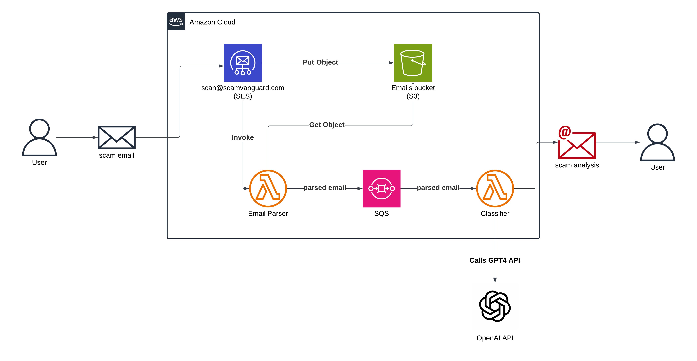

# ScamVanguard 🛡️

**Protect yourself from email scams with AI-powered analysis**

ScamVanguard is a free, serverless service that helps identify potential scams in emails. Simply forward suspicious emails to our service and receive a quick SAFE/SCAM verdict with a clear explanation.

## Features

- **Email Analysis**: Forward suspicious emails for instant AI-powered analysis
- **AI-Powered Detection**: Uses OpenAI GPT-5 for intelligent scam detection
- **Domain Legitimacy Checks**: Automatically identifies spoofed domains and public email abuse
- **Simple Interface**: Easy-to-understand responses with clear verdicts
- **Privacy-First**: No user data stored beyond 24 hours
- **Rate Limiting**: Protection against abuse (10 emails/hour per user)
- **Instant Results**: Responses typically within 30 seconds

## How to Use

### Email Analysis
Forward suspicious emails to: **scan@scamvanguard.com**

### Response Format
You'll receive a response with:
- ✅ **SAFE**: Content appears legitimate
- 🚨 **SCAM**: High likelihood of scam
- ⚠️ **UNSURE**: Unable to determine - exercise caution

Each verdict includes a detailed explanation to help you understand the reasoning and security tips to stay safe.

## Architecture

ScamVanguard is built on AWS using a completely serverless, container-based architecture:



### Email Processing Flow

```
1. User forwards suspicious email to scan@scamvanguard.com
                           ↓
2. AWS SES receives email and stores in S3
                           ↓
3. SES triggers Email Parser Lambda (container)
                           ↓
4. Email Parser extracts original sender, checks rate limits
                           ↓
5. Email Parser sends to SQS queue for classification
                           ↓
6. Classifier Lambda (container) picks up from queue
                           ↓
7. Classifier performs domain legitimacy checks
                           ↓
8. If needed, Classifier calls OpenAI GPT-5 for analysis
                           ↓
9. Classifier generates HTML/text response email
                           ↓
10. Response email sent back to user via SES
```

### Key Components

- **AWS SES**: Receives and sends emails
- **AWS Lambda (Containers)**: Serverless compute running Python 3.13 Docker images
  - `email_parser`: Parses forwarded emails, rate limiting, extracts sender
  - `classifier`: AI classification, domain checks, response generation
  - `forward_contact`: Forwards contact@ emails to personal inbox
  - `ses_feedback_processor`: Handles bounce/complaint notifications
- **Amazon ECR**: Stores Lambda container images with versioning
- **Amazon SQS**: Message queuing for reliable async processing
- **Amazon S3**: Temporary storage for email attachments (auto-deleted after 24h)
- **Amazon DynamoDB**: Rate limiting and email suppression list with TTL
- **OpenAI GPT-4**: AI model for scam detection
- **AWS Secrets Manager**: Secure API key storage
- **CloudWatch**: Logging, metrics, and monitoring
- **SNS**: Bounce and complaint notifications

### Security Features

- **Rate Limiting**: 10 emails per hour per sender
- **Automatic Suppression**: 24-hour blocks for rate limit violations
- **Bounce/Complaint Handling**: Automatic suppression list updates
- **No Long-Term Storage**: All email content deleted after 24 hours
- **Encryption**: S3, SQS, and Secrets Manager use encryption at rest
- **Least Privilege IAM**: Lambda functions use minimal required permissions
- **Container Security**: ECR image scanning on push

## Deployment

### Prerequisites

- AWS Account
- Terraform >= 1.0
- Docker with buildx support
- AWS CLI configured
- Domain with DNS access (for SES setup)
- OpenAI API key

### Infrastructure Setup

```bash
# Clone the repository
git clone https://github.com/haydencj/scamvanguard-infrastructure.git
cd scamvanguard-infrastructure

# Configure variables
cp terraform.tfvars.example terraform.tfvars
# Edit terraform.tfvars with your values

# Initialize Terraform
terraform init

# Deploy infrastructure
terraform plan
terraform apply
```

### CI/CD Pipeline

The project uses GitHub Actions with AWS OIDC for secure, automated deployments:

- **Automatic Deployments**: Push to `main` triggers builds for changed functions only
- **Container-Based**: Lambda functions deployed as Docker images to ECR
- **Version Tracking**: Each deployment tagged with git commit SHA
- **No Stored Credentials**: Uses AWS OIDC for temporary credentials
- **Selective Builds**: Only builds and deploys functions that changed

See [`.github/workflows/deploy.yml`](.github/workflows/deploy.yml) for details.

### Manual Lambda Updates

```bash
# Build and push a specific Lambda function
cd lambda_functions/classifier
docker buildx build --platform linux/amd64 --provenance=false -t classifier:latest .
docker tag classifier:latest <ACCOUNT_ID>.dkr.ecr.us-east-1.amazonaws.com/scamvanguard/lambda-functions:classifier-latest
docker push <ACCOUNT_ID>.dkr.ecr.us-east-1.amazonaws.com/scamvanguard/lambda-functions:classifier-latest

# Update Lambda function
aws lambda update-function-code \
  --function-name ScamVanguardClassifier \
  --image-uri <ACCOUNT_ID>.dkr.ecr.us-east-1.amazonaws.com/scamvanguard/lambda-functions:classifier-latest
```

### DNS Configuration

After deployment, add these DNS records (values output by Terraform):

1. **SES Domain Verification**: TXT record at `_amazonses.yourdomain.com`
2. **DKIM Records**: 3 CNAME records for email authentication
3. **MX Record**: Points to AWS SES inbound endpoint

## Project Structure

```
scamvanguard-infrastructure/
├── .github/
│   └── workflows/
│       └── deploy.yml              # CI/CD pipeline
├── lambda_functions/
│   ├── email_parser/
│   │   ├── Dockerfile
│   │   ├── email_parser.py
│   │   └── requirements.txt
│   ├── classifier/
│   │   ├── Dockerfile
│   │   ├── classifier.py
│   │   └── requirements.txt
│   ├── forward_contact/
│   │   ├── Dockerfile
│   │   ├── forward_contact.py
│   │   └── requirements.txt
│   └── ses_feedback_processor/
│       ├── Dockerfile
│       ├── ses_feedback_processor.py
│       └── requirements.txt
├── testing/                        # Integration tests
├── main.tf                         # Main Terraform configuration
├── variables.tf                    # Terraform variables
└── terraform.tfvars                # Your configuration (gitignored)
```

## Cost Estimate

ScamVanguard is designed to be extremely cost-effective:

- **Lambda**: Free tier covers ~1M requests/month
- **S3**: Minimal cost (~$0.01/month for temporary storage)
- **SES**: $0.10 per 1,000 emails received/sent
- **SQS**: First 1M requests free
- **DynamoDB**: Pay-per-request, typically <$1/month
- **ECR**: $0.10/GB/month for image storage
- **OpenAI API**: Variable based on usage (~$0.002 per classification)

**Estimated cost for 1,000 emails/month: ~$2-5**

## Monitoring

CloudWatch dashboard includes:
- Email received/classified counters
- Classification distribution (SAFE/SCAM/UNSURE)
- Error rates
- Lambda invocation metrics

Alarms configured for:
- High bounce rate (>0.05%)
- High complaint rate (>0.001%)

## Contact

For questions or support, email: contact@scamvanguard.com

## Website

Visit [scamvanguard.com](https://scamvanguard.com) for more information.
